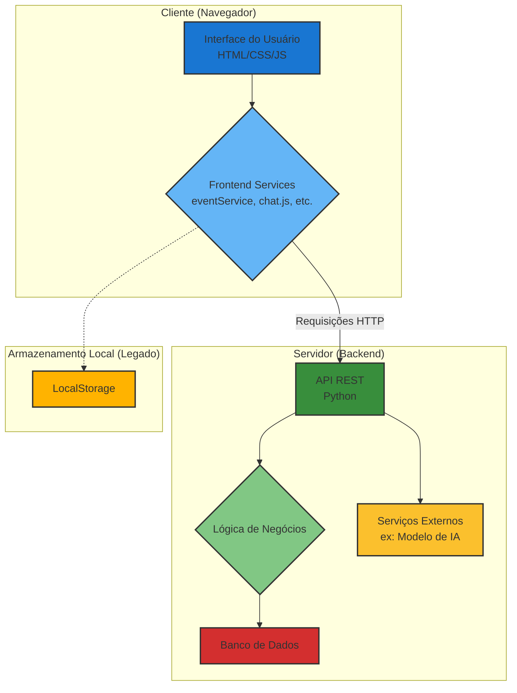

## Documento de Arquitetura de Software

### 1. Visão Geral

Este documento descreve a arquitetura da aplicação **Agenda Pessoal**, um sistema de gerenciamento de informações pessoais e acadêmicas. A aplicação evoluiu de uma solução puramente de frontend para uma arquitetura **cliente-servidor**. Embora a interface do usuário continue rica e interativa no navegador, as principais funcionalidades agora dependem de um backend para persistência de dados, lógica de negócios e comunicação em tempo real.

### 2. Arquitetura Lógica

A aplicação segue um padrão de **Single Page Application (SPA)** para o frontend, interagindo com um **backend** através de APIs REST. A arquitetura é dividida nas seguintes camadas:

- **Camada de Apresentação (Frontend):** Responsável pela interface do usuário, construída com HTML5, CSS3 e JavaScript. Utiliza o framework Bootstrap para um design responsivo e jQuery para manipulação do DOM.
- **Camada de Serviços (Frontend Services):** Módulos JavaScript no lado do cliente que encapsulam a lógica de comunicação com o backend e a gestão de estado. Os principais serviços incluem:
    - `eventService.js`: Gerencia eventos e calendário (ainda pode usar `localStorage`).
    - `todoService.js`: Gerencia tarefas (ainda pode usar `localStorage`).
    - `educationService.js`: Gerencia a lógica acadêmica (disciplinas, turmas).
    - `lessonPlanService.js`: Gerencia planos de aula.
    - `materialService.js`: Gerencia materiais de estudo.
    - `quizService.js` e `questionService.js`: Gerenciam o banco de questões e os quizzes.
    - `chat.js`: Habilita a funcionalidade de chat com um assistente de IA.
    - `settingsService.js`: Gerencia as configurações do usuário.
    - `notificationService.js`: Orquestra as notificações no navegador.
- **Camada de Backend (Server):** Um servidor (provavelmente Python, com base no script `launch.py`) que expõe uma API REST para o frontend. É responsável por:
    - Autenticação e autorização (se aplicável).
    - Lógica de negócios centralizada.
    - Persistência de dados em um banco de dados.
    - Integração com serviços externos (como modelos de IA para o chat).
- **Camada de Dados (Storage):** A persistência de dados é híbrida. Alguns dados legados ou não críticos (como tarefas simples) podem ainda usar o `localStorage` do navegador. No entanto, a maioria dos dados (planos de aula, materiais, configurações, etc.) é persistida em um banco de dados central gerenciado pelo backend.

### 3. Tecnologias Utilizadas

- **HTML5:** Para a estruturação do conteúdo da aplicação.
- **CSS3:** Para a estilização da interface, com o apoio do **Bootstrap** para componentes e responsividade.
- **JavaScript (ES6+):** Para a lógica da aplicação, incluindo manipulação do DOM, gerenciamento de eventos e lógica de negócios.
- **jQuery:** Utilizado para simplificar a manipulação do DOM.
- **Marked.js:** Biblioteca para a renderização de Markdown, utilizada na funcionalidade de chat.
- **PapaParse:** Biblioteca para a importação de dados de alunos a partir de arquivos CSV.
- **Python (Backend):** O servidor backend é implementado em Python, servindo tanto os arquivos estáticos quanto a API.

### 4. Diagrama de Arquitetura

### 5. Considerações de Segurança

- **Validação de Dados:** A validação é realizada no lado do cliente antes de os dados serem salvos no `localStorage`.
- **Escopo de Dados:** A aplicação agora opera em um modelo cliente-servidor. Os dados são enviados para um servidor central, portanto, medidas de segurança apropriadas (como HTTPS, validação no servidor) são essenciais.

### 6. Desempenho

- **Carregamento Assíncrono:** As diferentes "páginas" (views) da aplicação são carregadas sob demanda, melhorando o tempo de carregamento inicial.
- **Minificação:** Os arquivos CSS e JavaScript são minificados para reduzir o tamanho dos assets e acelerar o carregamento.
