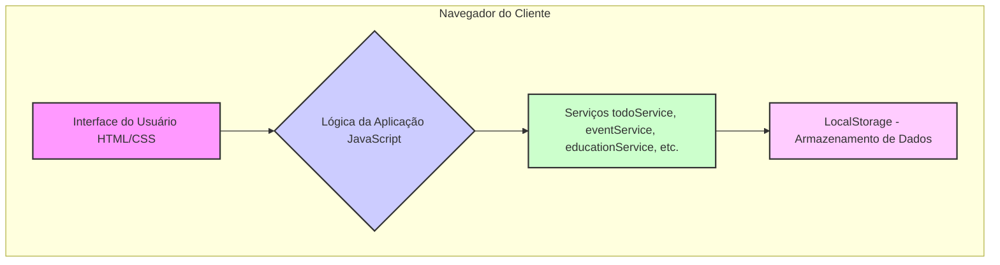

## Documento de Arquitetura de Software

### 1. Visão Geral

Este documento descreve a arquitetura da aplicação **Agenda Pessoal**, um sistema de gerenciamento de informações pessoais e acadêmicas. A aplicação foi projetada para ser uma ferramenta intuitiva e eficiente, permitindo que os usuários organizem suas tarefas, eventos e materiais de estudo em um único lugar.

### 2. Arquitetura Lógica

A aplicação segue o padrão de **Single Page Application (SPA)**, onde a interface é carregada uma única vez e as atualizações de conteúdo são feitas dinamicamente. A arquitetura é dividida em três camadas principais:

- **Camada de Apresentação (Frontend):** Responsável pela interface do usuário, construída com HTML5, CSS3 e JavaScript. Utiliza o framework Bootstrap para garantir um design responsivo.
- **Camada de Serviços (Services):** Composta por módulos JavaScript que encapsulam a lógica de negócios. Além dos serviços existentes `(`todoService.js`, `eventService.js`)`, foi adicionado o `educationService.js`, que gerencia toda a lógica de disciplinas, turmas, alunos e avaliações.
- **Camada de Dados (Storage):** Os dados continuam a ser armazenados localmente no `localStorage`, agora incluindo novas chaves para os dados acadêmicos (ex: `subjects`, `classes`, `students`).

### 3. Tecnologias Utilizadas

- **HTML5:** Para a estruturação do conteúdo da aplicação.
- **CSS3:** Para a estilização da interface, com o apoio do **Bootstrap** para componentes e responsividade.
- **JavaScript (ES6+):** Para a lógica da aplicação, incluindo manipulação do DOM, gerenciamento de eventos e lógica de negócios.
- **jQuery:** Utilizado para simplificar a manipulação do DOM.
- **PapaParse:** Biblioteca para a importação de dados de alunos a partir de arquivos CSV.

### 4. Diagrama de Arquitetura

### 5. Considerações de Segurança

- **Validação de Dados:** A validação é realizada no lado do cliente antes de os dados serem salvos no `localStorage`.
- **Escopo de Dados:** Como todos os dados são armazenados localmente, não há risco de exposição de informações em um servidor central.

### 6. Desempenho

- **Carregamento Assíncrono:** As diferentes "páginas" (views) da aplicação são carregadas sob demanda, melhorando o tempo de carregamento inicial.
- **Minificação:** Os arquivos CSS e JavaScript são minificados para reduzir o tamanho dos assets e acelerar o carregamento.
