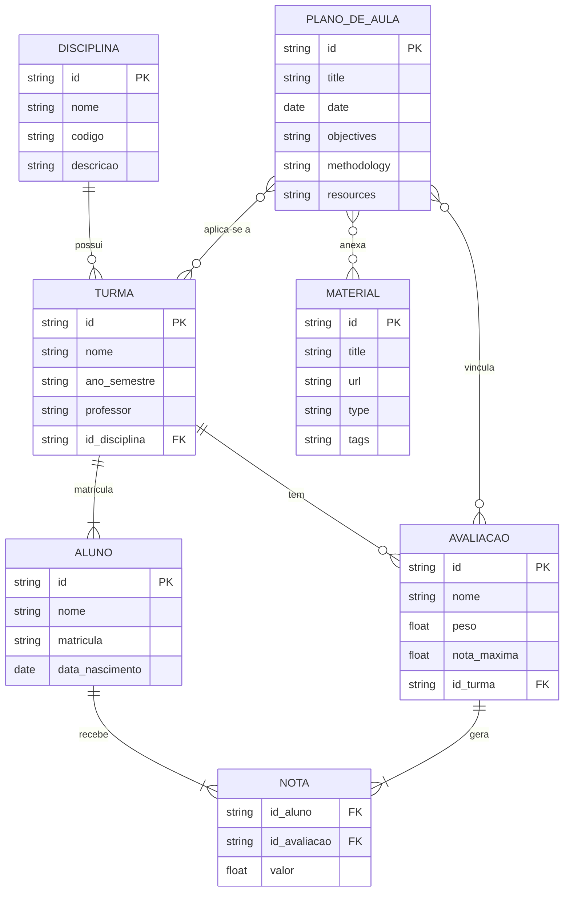
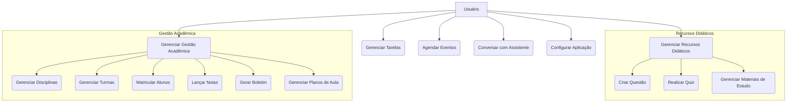

## Diagramas do Sistema

### Diagrama de Entidade-Relacionamento (DER)

O diagrama abaixo representa a estrutura de dados do sistema, com as principais entidades e seus relacionamentos, incluindo as novas funcionalidades de Planos de Aula e Materiais.

### Diagrama de Casos de Uso

Este diagrama mostra as interações entre o usuário e as principais funcionalidades do sistema, incluindo as novas funcionalidades.

